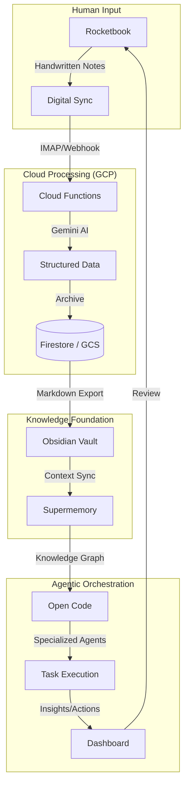

# My Second Brain

A personal knowledge laboratory leveraged by **Obsidian** as the markdown foundation, designed for agentic intelligence and deep reflection.

## 🏗️ High-Level Architecture

---

## 🏛️ The Ignatian Roots of Reflection

The core of this system is the **Ignatian Habit Tracker**. These three reflective questions stem from a 500-year-old tradition of daily self-examination known as the **Examen of Conscience**, formalized by **St. Ignatius of Loyola** (1491–1556), the founder of the Jesuits.

### The Three Pillars
1. **What wrong did I do?**
   - *Recognition of faults, sins, or harmful habits.*
2. **What good did I accomplish?**
   - *Gratitude for actions, growth, and grace.*
3. **What did I forget or fail to do?**
   - *Awareness of omissions and missed duties.*

### Historical Context
While Ignatius systematized this into a repeatable spiritual and behavioral framework, its roots reach back even further to **Stoic philosophy**:
- **Seneca** (1st century AD): Reviewed each day at night, asking: *"What bad habit did you cure today? What fault did you resist? In what respect are you better?"*
- **Epictetus**: Taught daily moral accounting as a path to virtue.

This repository bridges these ancient wisdom traditions with modern AI, making the practice "brief, honest, and daily" as Ignatius encouraged, but with the added power of agentic synthesis.

---

## 💎 Why Obsidian?

Obsidian serves as the **Markdown Foundation** for this laboratory. While many tools exist, Obsidian provides the best balance for an agentic second brain.

### Pros
- **Local-First & Future-Proof**: Your data lives on your machine in standard Markdown. No vendor lock-in.
- **Agent-Friendly**: Markdown is the native language of LLMs. Agents can easily parse, modify, and generate documents without complex APIs.
- **Graph Visualization**: Semantic linking mimics human thought and helps identify knowledge clusters.
- **Infinite Extensibility**: A rich plugin ecosystem allows for custom workflows and automation.

### Cons (vs. Other Approaches)
- **Sync Overhead**: Requires a strategy (Git, Cloud, or Obsidian Sync) compared to SaaS tools like Notion.
- **Mobile Experience**: Can be less fluid than cloud-native mobile apps for quick capture (remedied here by **Rocketbook** integration).

**Verdict**: Obsidian is not overhead; it is the **Ground Truth**. It ensures that the knowledge remains human-readable for decades while being agent-ingestible today.

---

## 🗺️ Roadmap

- [x] **Phase 0**: Initialize Repository & Cleanse Sensitive Data.
- [/] **Phase 1**: Finalize IMAP ingestion for Rocketbook reflections.
- [ ] **Phase 2**: Deep integration between Obsidian vault and Supermemory graph.
- [ ] **Phase 3**: Deploy [Oh My OpenCode](https://github.com/open-code-orchestrator) orchestrator for automated processing.

---

## 🚀 Repository Structure

- **`apps/dashboard`**: Next.js dashboard for visualizing the Knowledge Base.
- **`packages/gcp-functions`**: Cloud Functions for IMAP ingestion and Gemini AI processing.
- **`archive/node-binance-trader-legacy`**: Deprecated legacy trader repo kept as reference only.
- **`packages/versioning`**: Composable versioning tool with extension system (reentry, cleanup, secrets).
- **`docs/`**: Detailed architecture, deployment docs, and the [trading rewrite migration plan](docs/TRADING_REWRITE_MIGRATION.md).

## ⚠️ Trading Stack

The active trading stack has been fully migrated to a **separate private repository**.
The legacy `node-binance-trader` remains at `archive/node-binance-trader-legacy` as a read-only reference.
See [docs/TRADING_REWRITE_MIGRATION.md](docs/TRADING_REWRITE_MIGRATION.md) for details.

## 📄 License
MIT
