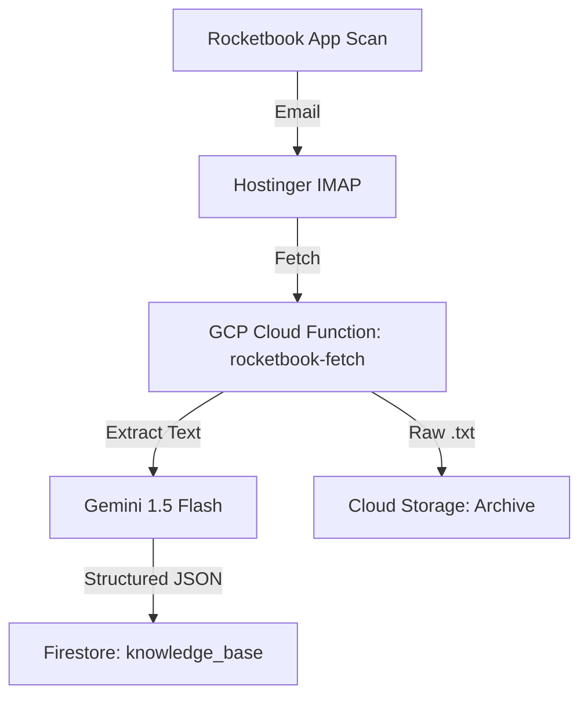

# System Architecture: Knowledge Ingestion & Visualization

This document describes the flow of data from scanning to visualization.

## 🔄 Data Inflow (Rocketbook to Firestore)

### 1. Extraction (GCP Functions)
The `rocketbook-fetch` function runs on a daily schedule (Midnight). It polls the Hostinger IMAP server for unread emails from Rocketbook. It extracts the `.txt` attachment (OCR transcription).

### 2. Enrichment (Vertex AI)
The raw text is passed to **Gemini 1.5 Flash**. The LLM performs:
- **Correction**: Fixes OCR handwriting errors.
- **Summarization**: Generates a 2-3 sentence summary.
- **Tagging**: Assigns relevant hashtags.
- **Action Items**: Extracts tasks or reminders.

### 3. Storage
- **Firestore**: Holds the structured JSON for fast querying.
- **GCS**: Archives the original raw transcription file for auditability.

## 🖥️ Visualization (Next.js Dashboard)

The Dashboard is a standalone Next.js app that connects to:
- **Firestore**: To display the "Knowledge Base" feed.
- **Memory Graph**: To visualize semantic connections between entries.
- **Supermemory API**: For centralized memory management.

## 🔐 IAM & Security
- **Service Account**: `admin-second-brain` with roles for Datastore, Storage, and AI Platform.
- **Isolation**: Shell environments isolated via `CLOUDSDK_CONFIG` and `gcp-env` helper.
