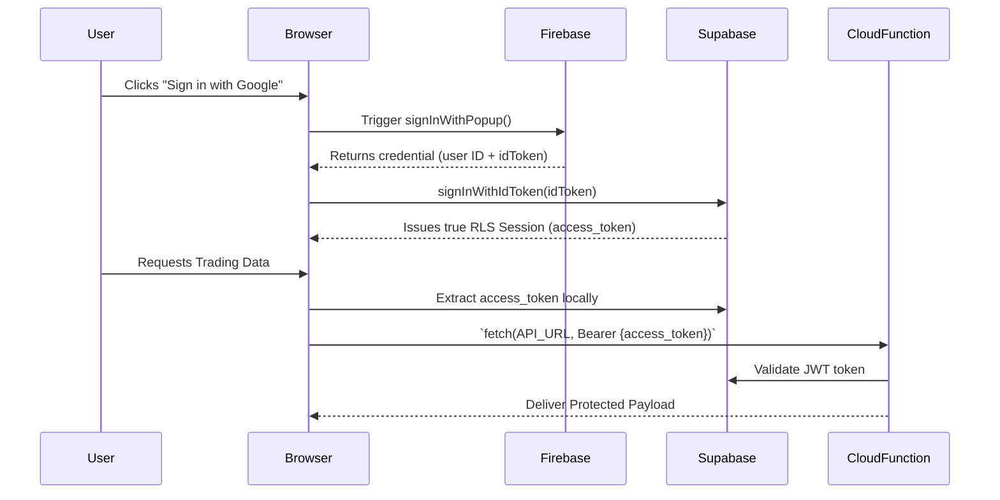

# Dashboard Frontend Architecture (Static Export & Hybrid API Flow)

## **1. The Challenge (Next.js on GitHub Pages)**
The Edward Dashboard uses `output: "export"` strictly in `next.config.mjs` to compile the entire front-end application down to static HTML, Javascript, and CSS files. This configuration allows it to be efficiently hosted on static services like GitHub Pages.

**The catch:** Next.js Server-side routes (e.g., `/api/status`, `/api/knowledge`) absolutely **cannot** be rendered dynamically at runtime on static site hosts, leading to bailout errors if not configured properly.

---

## **2. The Solution: Environment-Aware Routing**
We built a decoupled, environment-first API router (`src/lib/api-config.ts`) that strictly evaluates the current build target.

*   **Local UI Development (`pnpm dev`)**
    When run locally, the API router actively targets internal Next.js endpoints (e.g., `http://localhost:3000/api/status`). The `/src/app/api/...` folder kicks into gear, querying Firebase/Supabase directly in the Node.js context and serving local results natively. This ensures instant feedback cycles.
*   **Production Deployment (`GitHub Pages`)**
    When exported and shipped, the built-in Next.js `/api/` folder is intentionally abandoned. The API router pivots entirely, intercepting traffic to those paths and re-routing the `fetch()` calls to remote micro-services such as:
    *   **GCP Cloud Functions** (`https://us-central1-second-brain-XXXX.cloudfunctions.net`)
    *   **External FastAPI Engines** (A-Quant)

---

## **3. Double-Binding Federated Auth Flow**
Because APIs are cleanly severed from the UI in production, user identities must be securely verifiable completely on the client side, then passed out to the production endpoints.

1.  **Orchestrator Level (`@ed/auth`)**: The Dashboard loads `HybridClient` using dependency-injected configurations. 
2.  **Firebase Popup UI Intercept**: Users sign in via Google OAuth utilizing Firebase's secure popup interface.
3.  **Parallel Synchronisation**: The pure `idToken` extracted from Firebase is secretly mapped back to Supabase via `signInWithIdToken()`. Supabase permanently provisions this Google Identity user into the `auth.users` PostgreSQL table.
4.  **JWT Distribution**: When the `dashboard-api.ts` module constructs a `fetchWithAuth()` generic API call meant for the Google Cloud Functions or the Python API:
    - It extracts the `access_token` purely from Supabase's `getSession()`.
    - Automatically injects it into standard `Authorization: Bearer <TOKEN>` CORS headers.
    - Cloud Functions and API Handlers effortlessly decode and verify session permissions against the Supabase source-of-truth.

### Flow Diagram

---

## **4. Developer Checklist for Release**
When modifying API routes, a developer must ensure:
1.  **Local Node Route**: Implement logic inside `src/app/api/your-route/route.ts` with `export const dynamic = 'force-static'` for Next.JS build compatibility.
2.  **Cloud Function Parity**: Build identical robust endpoint logic within `packages/gcp-functions`.
3.  **Router Registry**: Map the new destination securely into the `cloudFunctionMap` config constant found in `src/lib/api-config.ts`.
