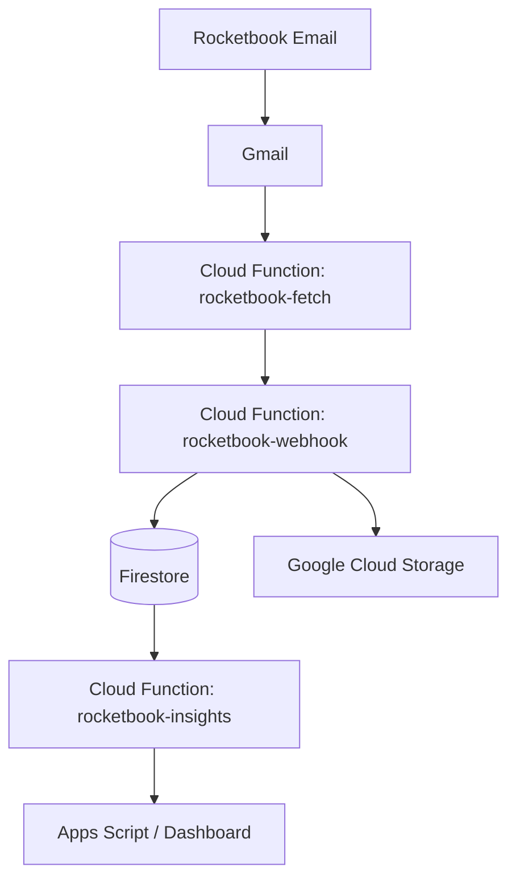

# Rocketbook Habit Tracker: Current Architecture

This document describes the current production architecture of the Rocketbook Habit Tracker system deployed on Google Cloud Platform (GCP).

## Overview
The system automates habit tracking by processing Rocketbook emails sent to Gmail, extracting habit data, and storing it in Firestore for analysis and visualization.

## Component Diagram

## System Components

### 1. Cloud Functions (Node.js 20, 2nd Gen)
- **`rocketbook-webhook`**: The main entry point. Receives webhook notifications from Apps Script or processed data to store in Firestore.
- **`rocketbook-fetch`**: Programmatically fetches unprocessed emails from Gmail using the Gmail API.
- **`rocketbook-insights`**: Aggregates Firestore data to generate habit streaks and completion reports.

### 2. Storage & Database
- **Google Cloud Firestore**: NoSQL database storing structured habit data synced from Rocketbook scans.
- **Google Cloud Storage**: Stores raw artifacts or temporary processing data (Bucket: `rocketbook-habit-tracker-second-brain-482901`).

### 3. Identity & Access (IAM)
- **Service Account**: `admin-second-brain@second-brain-482901.iam.gserviceaccount.com`
- **Security**: Deployments follow least-privilege principles, isolated via custom GCP Shell configurations (`gcp-env deployment`).

## Maintenance
- **Deployment Script**: `daily/deploy-gcp.sh` handles API enablement, IAM bindings, and function updates.
- **Config**: Service account keys are stored in `daily/config/private.json` (git-ignored/secure).
