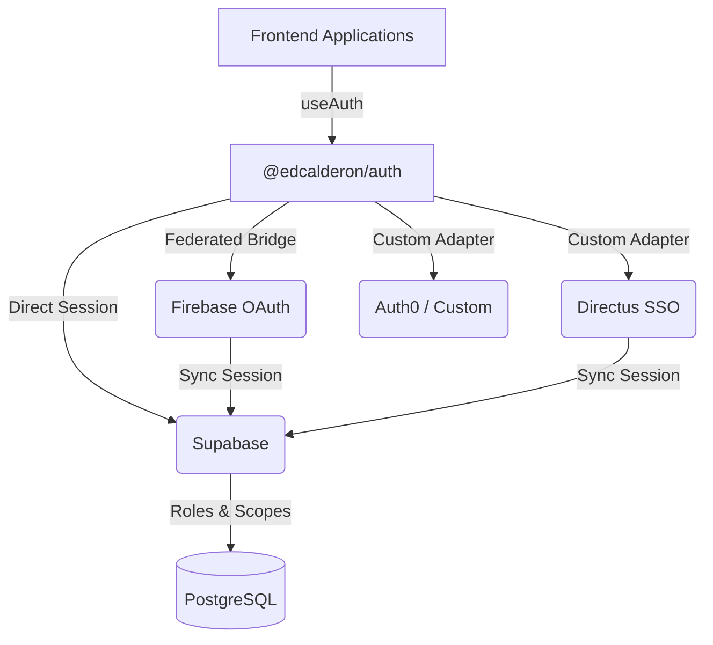

# @edcalderon/auth

[](https://www.npmjs.com/package/@edcalderon/auth)
[](https://www.npmjs.com/package/@edcalderon/auth)
[](https://github.com/edcalderon/my-second-brain/tree/main/packages/auth)

A universal, **provider-agnostic** authentication orchestration package for React applications. Swap between Supabase, Firebase, Directus, Google OAuth, or any custom provider without changing a single line of component code.

---

## 📋 Latest Changes (v1.0.3)

### Fixed

- 🐛 Updated import from `@ed/auth` (old internal alias) to `@edcalderon/auth` in dashboard consumer
- 📝 Added `update-readme` script — uses `versioning update-readme` to keep README in sync with CHANGELOG
- 🔄 Versioning package used as dev dependency for README maintenance

For full version history, see [CHANGELOG.md](./CHANGELOG.md) and [GitHub releases](https://github.com/edcalderon/my-second-brain/releases)

---

## 🏗️ Architecture

The package follows a **Single Source of Truth** model with a **Federated OAuth Strategy**:

- **Principal Database (Source of Truth)**: Supabase anchors user identities, metadata, roles, and RLS policies in PostgreSQL (`auth.users`, `auth.identities`).
- **OAuth / Identity Providers**: External services (Firebase, Directus, native Google OAuth, Auth0, etc.) handle frontend login bridges or federated SSO flows.
- **The Orchestrator (`@edcalderon/auth`)**: A thin bridge layer that exposes generic interfaces (`User`, `AuthClient`). Applications consume a unified context without coupling to any specific vendor.



---

## Features

- 🎯 **Provider-Agnostic** — one interface, any backend
- ⚛️ **React-First** — `AuthProvider` + `useAuth` hook with full TypeScript types
- 🔌 **Extensible Adapter System** — implement `AuthClient` to add any provider
- 🔀 **Hybrid Flows** — Firebase popup → Supabase session bridging out of the box
- 🛡️ **Unified User Model** — `User` type normalizes identities across providers
- 🔑 **Session Token Access** — `getSessionToken()` for API calls regardless of provider
- 📦 **Tree-Shakeable** — import only the adapters you need
- 🏗️ **Zero Lock-In** — swap providers by changing one line of dependency injection

---

## Installation

### From NPM (public)

```bash
npm install @edcalderon/auth
# or
pnpm add @edcalderon/auth
# or
yarn add @edcalderon/auth
```

### From Monorepo (internal workspace)

```bash
pnpm --filter <your-app> add @edcalderon/auth@workspace:*
```

### Peer Dependencies

Install the peer dependencies for your chosen provider(s):

```bash
# For Supabase
pnpm add @supabase/supabase-js

# For Firebase
pnpm add firebase

# For Hybrid (Firebase + Supabase)
pnpm add @supabase/supabase-js firebase
```

> **Note:** `react` and `react-dom` (v18+ or v19+) are required peer dependencies.

---

## Quick Start

### 1. Choose Your Provider

| Provider | Class | Peer Dependency | Use Case |
|----------|-------|-----------------|----------|
| Supabase | `SupabaseClient` | `@supabase/supabase-js` | Direct Supabase Auth |
| Firebase | `FirebaseClient` | `firebase` | Firebase-only applications |
| Hybrid | `HybridClient` | Both | Firebase popup → Supabase session |
| Custom | Implement `AuthClient` | Your choice | Directus, Auth0, Keycloak, etc. |

### 2. Create the Provider Wrapper

#### Supabase (Direct)

```tsx
// components/auth/AuthProvider.tsx
"use client";

import { AuthProvider as UniversalAuthProvider, SupabaseClient, useAuth as useUniversalAuth } from "@edcalderon/auth";
import { supabase } from "@/lib/supabase";
import { useMemo, type ReactNode } from "react";

export function AuthProvider({ children }: { children: ReactNode }) {
    const client = useMemo(() => new SupabaseClient(supabase), []);
    return <UniversalAuthProvider client={client}>{children}</UniversalAuthProvider>;
}

export const useAuth = useUniversalAuth;
```

#### Hybrid (Firebase → Supabase)

```tsx
"use client";

import { AuthProvider as UniversalAuthProvider, HybridClient, useAuth as useUniversalAuth } from "@edcalderon/auth";
import { supabase } from "@/lib/supabase";
import { auth, googleProvider, signInWithPopup, signOut, GoogleAuthProvider } from "@/lib/firebase";
import { useMemo, type ReactNode } from "react";

export function AuthProvider({ children }: { children: ReactNode }) {
    const client = useMemo(() => new HybridClient({
        supabase,
        firebaseAuth: auth,
        firebaseMethods: {
            signInWithPopup,
            signOut,
            credentialFromResult: GoogleAuthProvider.credentialFromResult,
        },
        googleProvider,
    }), []);

    return <UniversalAuthProvider client={client}>{children}</UniversalAuthProvider>;
}

export const useAuth = useUniversalAuth;
```

### 3. Use in Components

Every component consumes **identical signatures** regardless of which provider is active:

```tsx
import { useAuth } from "@/components/auth/AuthProvider";

export default function Dashboard() {
    const { user, loading, error, signInWithGoogle, signOutUser } = useAuth();

    if (loading) return <Spinner />;
    if (error) return <p>Error: {error}</p>;
    if (!user) return <button onClick={() => signInWithGoogle()}>Sign In with Google</button>;

    return (
        <div>
            <p>Welcome, {user.email} (via {user.provider})</p>
            <button onClick={signOutUser}>Sign Out</button>
        </div>
    );
}
```

---

## 🔌 Extensibility — Custom Adapters

The core strength of `@edcalderon/auth` is that **any authentication provider** can be integrated by implementing the `AuthClient` interface. No changes to your React components are required.

### The `AuthClient` Interface

```typescript
export interface AuthClient {
    getUser(): Promise<User | null>;
    signInWithEmail(email: string, password: string): Promise<User>;
    signInWithGoogle(redirectTo?: string): Promise<void>;
    signOut(): Promise<void>;
    onAuthStateChange(callback: (user: User | null) => void): () => void;
    getSessionToken(): Promise<string | null>;
}
```

### The `User` Type

```typescript
export interface User {
    id: string;
    email?: string;
    avatarUrl?: string;
    provider?: string;
    metadata?: Record<string, any>;
}
```

### Example: Directus Adapter

A custom Directus adapter that uses Directus SSO (e.g., Google OAuth through Directus) and optionally syncs sessions back to Supabase:

```typescript
import type { AuthClient, User } from "@edcalderon/auth";

interface DirectusClientOptions {
    directusUrl: string;
    supabase?: any; // Optional: sync to Supabase as source of truth
}

export class DirectusClient implements AuthClient {
    private directusUrl: string;
    private supabase: any;
    private currentUser: User | null = null;
    private listeners: Set<(user: User | null) => void> = new Set();

    constructor(options: DirectusClientOptions) {
        this.directusUrl = options.directusUrl;
        this.supabase = options.supabase;
    }

    private mapUser(directusUser: any): User | null {
        if (!directusUser) return null;
        return {
            id: directusUser.id,
            email: directusUser.email,
            avatarUrl: directusUser.avatar
                ? `${this.directusUrl}/assets/${directusUser.avatar}`
                : undefined,
            provider: "directus",
            metadata: {
                firstName: directusUser.first_name,
                lastName: directusUser.last_name,
                role: directusUser.role,
            },
        };
    }

    async getUser(): Promise<User | null> {
        try {
            const res = await fetch(`${this.directusUrl}/users/me`, {
                credentials: "include",
            });
            if (!res.ok) return null;
            const { data } = await res.json();
            this.currentUser = this.mapUser(data);
            return this.currentUser;
        } catch {
            return null;
        }
    }

    async signInWithEmail(email: string, password: string): Promise<User> {
        const res = await fetch(`${this.directusUrl}/auth/login`, {
            method: "POST",
            headers: { "Content-Type": "application/json" },
            credentials: "include",
            body: JSON.stringify({ email, password }),
        });
        if (!res.ok) throw new Error("Directus login failed");
        const user = await this.getUser();
        if (!user) throw new Error("No user after login");
        this.notifyListeners(user);

        // Optional: sync to Supabase
        if (this.supabase) {
            await this.syncToSupabase(user);
        }
        return user;
    }

    async signInWithGoogle(redirectTo?: string): Promise<void> {
        // Directus SSO — redirect to Directus Google OAuth endpoint
        const callback = redirectTo || window.location.origin + "/auth/callback";
        window.location.href =
            `${this.directusUrl}/auth/login/google?redirect=${encodeURIComponent(callback)}`;
    }

    async signOut(): Promise<void> {
        await fetch(`${this.directusUrl}/auth/logout`, {
            method: "POST",
            credentials: "include",
        });
        this.currentUser = null;
        this.notifyListeners(null);
    }

    onAuthStateChange(callback: (user: User | null) => void): () => void {
        this.listeners.add(callback);
        return () => { this.listeners.delete(callback); };
    }

    async getSessionToken(): Promise<string | null> {
        try {
            const res = await fetch(`${this.directusUrl}/auth/refresh`, {
                method: "POST",
                credentials: "include",
            });
            if (!res.ok) return null;
            const { data } = await res.json();
            return data?.access_token ?? null;
        } catch {
            return null;
        }
    }

    private notifyListeners(user: User | null) {
        this.listeners.forEach((cb) => cb(user));
    }

    private async syncToSupabase(user: User) {
        // Sync user identity to Supabase as source of truth
        // Implementation depends on your Supabase setup
    }
}
```

**Usage:**

```tsx
import { AuthProvider as UniversalAuthProvider } from "@edcalderon/auth";
import { DirectusClient } from "./adapters/DirectusClient";

const client = new DirectusClient({
    directusUrl: "https://directus.example.com",
    supabase: supabaseInstance, // optional sync
});

<UniversalAuthProvider client={client}>
    <App />
</UniversalAuthProvider>
```

### Example: Auth0 Adapter (Skeleton)

```typescript
import type { AuthClient, User } from "@edcalderon/auth";

export class Auth0Client implements AuthClient {
    constructor(private auth0: any) {}

    async getUser(): Promise<User | null> { /* ... */ }
    async signInWithEmail(email: string, password: string): Promise<User> { /* ... */ }
    async signInWithGoogle(redirectTo?: string): Promise<void> { /* ... */ }
    async signOut(): Promise<void> { /* ... */ }
    onAuthStateChange(callback: (user: User | null) => void): () => void { /* ... */ }
    async getSessionToken(): Promise<string | null> { /* ... */ }
}
```

By implementing the `AuthClient` interface, any provider fits into the same `<AuthProvider>` and `useAuth()` workflow — **zero changes** to your component tree.

---

## Built-in Adapters

### `SupabaseClient`

Direct Supabase Auth adapter. Uses `@supabase/supabase-js` for session management, OAuth, and email/password.

```typescript
import { SupabaseClient } from "@edcalderon/auth";
import { createClient } from "@supabase/supabase-js";

const supabase = createClient(SUPABASE_URL, SUPABASE_ANON_KEY);
const client = new SupabaseClient(supabase);
```

**Features:**
- Email/password sign-in (`signInWithPassword`)
- Google OAuth (`signInWithOAuth`)
- Session token via `getSession().access_token`
- Real-time auth state changes via `onAuthStateChange`

### `FirebaseClient`

Firebase-only adapter. Uses Firebase Auth methods via dependency injection (tree-shaking friendly).

```typescript
import { FirebaseClient } from "@edcalderon/auth";
import { getAuth, GoogleAuthProvider, signInWithEmailAndPassword, signInWithPopup, signOut, onAuthStateChanged } from "firebase/auth";

const auth = getAuth(app);
const client = new FirebaseClient(auth, {
    signInWithEmailAndPassword,
    signInWithPopup,
    signOut,
    onAuthStateChanged,
}, new GoogleAuthProvider());
```

**Features:**
- Email/password sign-in
- Google popup sign-in
- Firebase ID token via `getIdToken()`
- Real-time auth state changes

### `HybridClient`

Bridges Firebase Google popup → Supabase `signInWithIdToken`. Perfect for apps that need Firebase's popup UX but Supabase as the data backend.

```typescript
import { HybridClient } from "@edcalderon/auth";

const client = new HybridClient({
    supabase,
    firebaseAuth: auth,
    firebaseMethods: { signInWithPopup, signOut, credentialFromResult: GoogleAuthProvider.credentialFromResult },
    googleProvider: new GoogleAuthProvider(),
});
```

**Features:**
- Firebase popup → extracts Google OIDC ID token → passes to Supabase `signInWithIdToken`
- Graceful fallback to Supabase native OAuth when Firebase is not configured
- Dual sign-out (Firebase + Supabase)
- Auth state tracked via Supabase session

---

## API Reference

### `<AuthProvider>`

React context provider that wraps your app with authentication state.

```tsx
<AuthProvider client={authClient}>
    {children}
</AuthProvider>
```

| Prop | Type | Description |
|------|------|-------------|
| `client` | `AuthClient` | The authentication adapter instance |
| `children` | `ReactNode` | Child components |

### `useAuth()`

React hook that returns the current authentication state and actions.

```typescript
const {
    user,              // User | null
    loading,           // boolean
    error,             // string | null
    client,            // AuthClient (direct access)
    signInWithEmail,   // (email: string, password: string) => Promise<User>
    signInWithGoogle,  // (redirectTo?: string) => Promise<void>
    signOutUser,       // () => Promise<void>
} = useAuth();
```

> **Note:** `useAuth()` must be called within an `<AuthProvider>`. It will throw if used outside the provider tree.

---

## Publishing & Releases

### Automated NPM Publishing

This package uses GitHub Actions for automated publishing to NPM when version tags are created.

#### Release Process

1. **Update Version**: Bump the version in `package.json`
   ```bash
   cd packages/auth
   npm version patch  # or minor, major
   ```

2. **Create Git Tag**: Create and push an `auth-v*` tag
   ```bash
   git add packages/auth/package.json
   git commit -m "chore(auth): bump version to X.Y.Z"
   git tag auth-vX.Y.Z
   git push && git push --tags
   ```

3. **Automated Publishing**: GitHub Actions will automatically build and publish to NPM

#### NPM Token Setup

To enable automated publishing:

1. Go to [NPM](https://www.npmjs.com/) → Access Tokens → Generate New Token
2. Create a token with **Automation** scope
3. Add to GitHub repository secrets as `NPM_TOKEN`

---

## Documentation

- **[CHANGELOG](CHANGELOG.md)** — Version history and changes
- **[GitHub Releases](https://github.com/edcalderon/my-second-brain/releases)** — Tagged releases

---

## License

MIT © Edward
